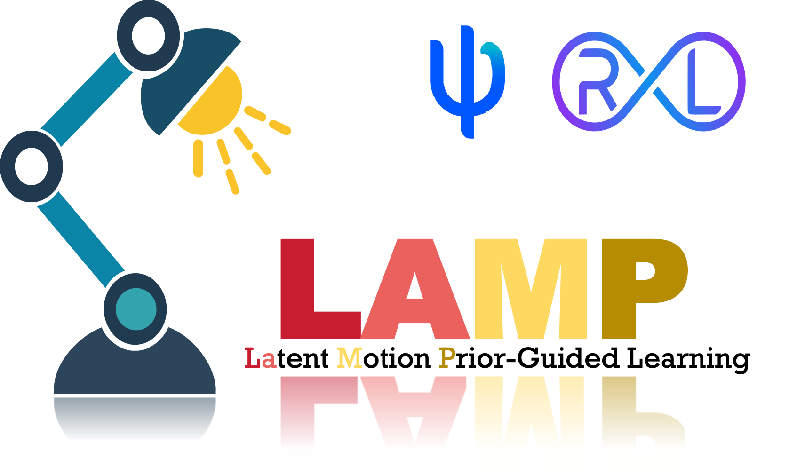
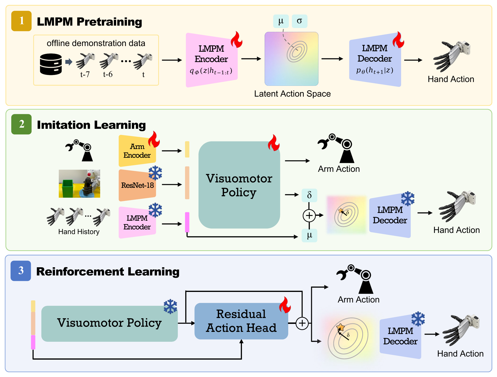

<div align="center">
  
  <h1>LAMP</h1>
  <p><strong>Latent Motion Prior-Guided Real-World Learning for Dexterous Hand Manipulation</strong></p>
  <p>
    <a href="https://dex-lamp.github.io/">Project Page</a> |
    Paper coming soon |
    <a href="https://github.com/dex-lamp/LAMP">GitHub</a> |
    <a href="LICENSE">MIT License</a>
  </p>
</div>



LAMP learns a compact, decodable latent interface for dexterous hand motion.
The released code covers the learning pieces used in the paper pipeline:
pretraining a latent hand-motion prior, training visuomotor behavior cloning
on top of that prior, and adapting the frozen policy with residual
reinforcement learning.

This repository is a research-code release. It does not include private robot
drivers, lab launch scripts, demonstration datasets, trained checkpoints,
reward services, calibration files, or experiment logs.

## What's Included

| Component | Path | Description |
| --- | --- | --- |
| Latent motion prior | `vae/` | JAX/Flax VAE for history-conditioned 6D hand-action prediction. |
| Behavior cloning | `imitation_learning/behavior_clone/` | Visuomotor BC policy with LAMP, raw, PCA, decoder-only, and VQ-VAE hand heads. |
| Residual RL | `reinforcement_learning/` | Environment-agnostic residual SAC/RLPD components for adapting a frozen BC policy. |
| PCA baseline | `pca/` | Linear low-dimensional hand-action baseline utilities. |
| VQ-VAE baseline | `vq-vae/` | DQ-RISE-style residual VQ hand-action codebook baseline. |
| Data utilities | `scripts/` | Demo conversion and action-format conversion helpers. |

## Quick Start

```bash
git clone https://github.com/dex-lamp/LAMP.git
cd LAMP

python -m venv .venv
source .venv/bin/activate
pip install -e .
```

Install the JAX build that matches your machine before running large training
jobs. For development checks:

```bash
pip install -e ".[dev]"
make check
```

The examples below assume trajectories are available under
`data/example_task/demos/success/{train,test}`. See
[`docs/data_format.md`](docs/data_format.md) for the expected file structure.

Train the latent motion prior:

```bash
python vae/scripts/train_jax.py \
  --train_dir data/example_task/demos/success/train \
  --test_dir data/example_task/demos/success/test \
  --output_dir outputs/hand_vae_example
```

Train the LAMP behavior-cloning policy:

```bash
TRAIN_DIR=data/example_task/demos/success/train \
TEST_DIR=data/example_task/demos/success/test \
VAE_CKPT=pretrained_models/jax_ckpt/hand_vae \
RESNET_PATH=microsoft/resnet-18 \
OUTPUT_DIR=outputs/behavior_clone_example \
bash imitation_learning/behavior_clone/scripts/train_example_jax.sh
```

Run the residual-RL import smoke check:

```bash
python reinforcement_learning/residual_rl/scripts/smoke_test_imports.py
```

## Documentation

- [`docs/data_format.md`](docs/data_format.md): trajectory format expected by
  VAE, BC, PCA, and VQ-VAE code.
- [`docs/training.md`](docs/training.md): end-to-end training flow from prior
  pretraining to behavior cloning.
- [`docs/baselines.md`](docs/baselines.md): raw, PCA, VQ-VAE, and decoder-only
  comparison modes.
- [`docs/residual_rl.md`](docs/residual_rl.md): public residual-RL boundary and
  integration sketch.

## Release Scope

The public code is intended for reproducing and extending the algorithmic
components. Real-robot deployment still requires an environment adapter that
provides observations, resets, rewards, action transport, safety handling, and
task-specific launch configuration.

The following local artifacts should stay out of this repository:

- private datasets, checkpoints, and logs;
- robot IPs, credentials, and lab-specific launch scripts;
- manuscript drafts, review material, and unreleased PDFs;
- upstream third-party datasets or checkpoints.

## Acknowledgements

Several baselines and infrastructure choices follow prior open-source
robot-learning work:

- `vq-vae/` is a JAX/Flax reproduction of the DQ-RISE-style quantized hand
  state baseline. If you report results from this mode, cite the LAMP release
  and DQ-RISE: https://github.com/rise-policy/DQ-RISE.
- `reinforcement_learning/` follows RLPD-style offline/online replay mixing
  and SERL/HiL-SERL-style JAX robotics RL conventions. Please cite those
  projects when using or discussing this part of the code:
  https://github.com/ikostrikov/rlpd,
  https://github.com/rail-berkeley/serl, and https://hil-serl.github.io/.
- The default BC visual backbone uses the HuggingFace Transformers
  `microsoft/resnet-18` checkpoint interface.

## Citation

The LAMP paper is not yet publicly archived. Until the public paper record and
BibTeX are available, please cite this software release or the exact commit
hash used in your experiments. `CITATION.cff` will be updated once the paper is
public.

## License

This code is released under the MIT License. See [`LICENSE`](LICENSE).
